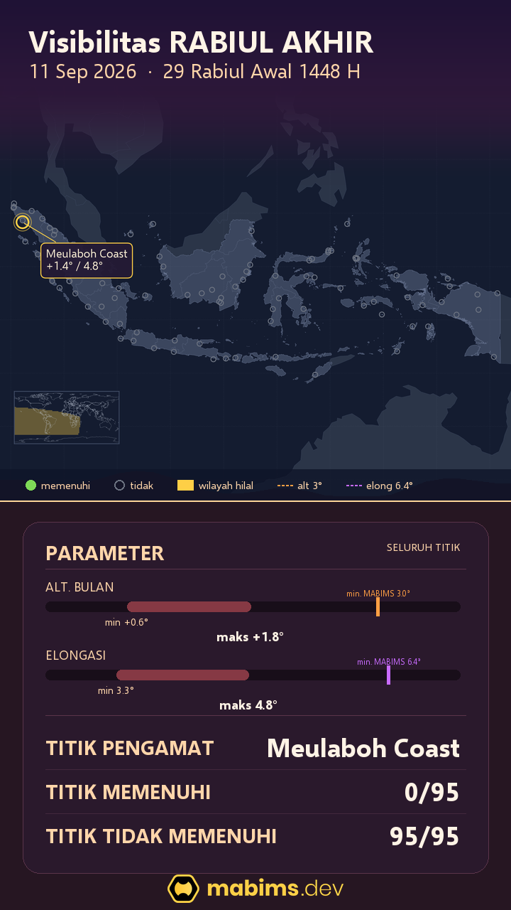
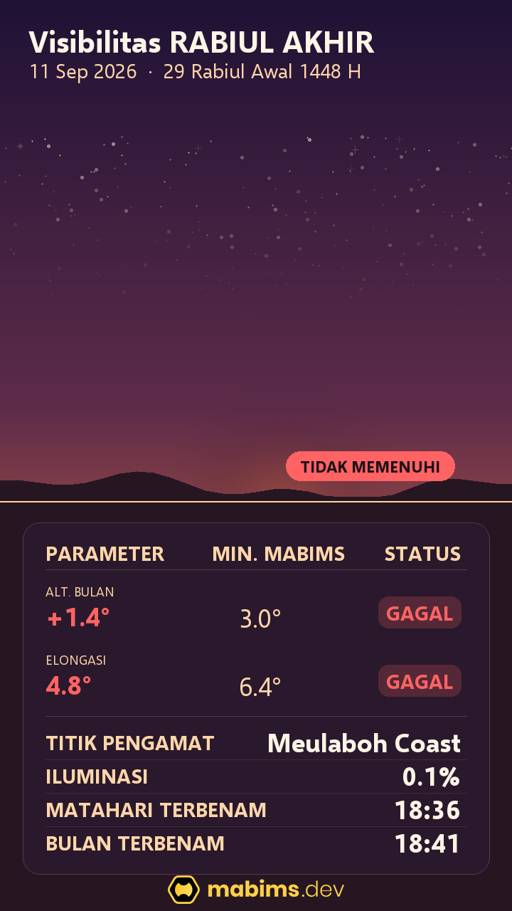

Apakah **Rabiul Awal 1448 H** berlangsung 29 hari atau 30 hari? Mari kita lihat datanya.

Untuk menjawab pertanyaan itu, kita perlu melihat keadaan hilal pada sore **11 September 2026**, bertepatan dengan 29 Rabiul Awal 1448 H. Jika hilal belum memenuhi kriteria, secara perhitungan bulan berjalan digenapkan menjadi 30 hari dan Rabiul Akhir dimulai setelahnya.

## Melihat petanya dulu

Saya mulai dari peta karena gambaran besarnya langsung terlihat. Tidak ada titik yang memenuhi kriteria, sedangkan **95 titik tidak memenuhi**. Lokasi dengan hasil paling baik adalah **Meulaboh Coast**, di pesisir barat Aceh. Bahkan di sana pun hasilnya masih belum cukup.

Peta ini memeriksa wilayah Indonesia dari banyak titik. Jadi, kesimpulannya bukan hanya karena pengamatan di satu tempat kurang baik. Pada sore itu, Bulan memang masih terlalu rendah dan terlalu dekat dengan Matahari di seluruh wilayah yang diperiksa.

## Lalu, apa yang terjadi di langit?

Gambar langit membantu menjelaskan angka-angka di peta. Di Meulaboh Coast, ketinggian Bulan hanya **1,4°**. Jarak sudutnya dari Matahari juga baru **4,8°**.

Padahal, kriteria Neo MABIMS mensyaratkan ketinggian Bulan minimal **3,0°** dan jarak sudut (elongasi) minimal **6,4°**. Kedua syarat ini harus terpenuhi sekaligus. Karena keduanya belum tercapai, gambar tersebut menampilkan status **TIDAK MEMENUHI**.

Sebagai pengingat, angka 3 dan 6,4 derajat ini adalah hasil penelitian ratusan pengamatan hilal. Kesimpulannya? Di bawah angka tersebut hilal mustahil dilihat dengan mata telanjang maupun dengan alat bantu teleskop.

Keadaan di ufuk juga kurang mendukung. Matahari terbenam pukul **18.36**, sementara Bulan terbenam pukul **18.41**. Waktu pengamatannya hanya sekitar **lima menit**. Bagian Bulan yang disinari Matahari pun baru **0,1 persen**, sehingga sabitnya masih sangat tipis.

## Kesimpulan

Dari data ini, Rabiul Awal 1448 H belum memenuhi kriteria Neo MABIMS pada sore 11 September 2026. Dengan demikian, menurut kriteria tersebut, Rabiul Awal digenapkan menjadi 30 hari dan awal Rabiul Akhir jatuh setelahnya.

Ini adalah hasil perhitungan visibilitas, bukan keputusan resmi penetapan awal bulan. Keputusan resmi tetap mengikuti proses rukyat dan sidang isbat oleh pihak yang berwenang.

Data lengkap tersedia melalui [data hilal MABIMS](https://api.mabims.dev/api/v1/hilal/info?month=4&year=1448) dan [visualisasi hilal](https://api.mabims.dev/api/v1/hilal/viz?month=4&year=1448).
